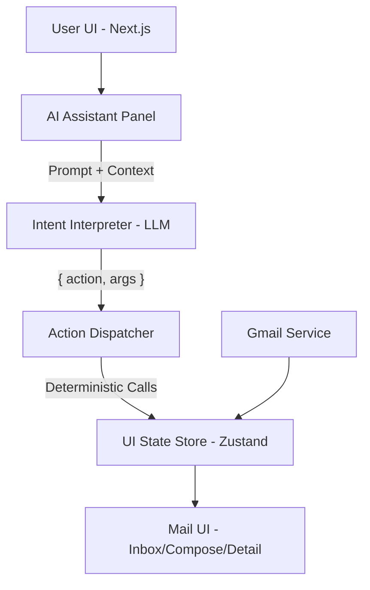

# AI Mail — AI-Controlled Email Client

An email application where the AI assistant **controls the UI** through structured actions, not just text responses.

```
Natural Language → Structured Intent → Deterministic UI Action → Visible UI Update
```

## 🧠 Architecture Overview

This app explicitly separates:
- **Mail Services** — Gmail API integration (currently mocked)
- **UI State** — Zustand stores for views, filters, drafts
- **AI Reasoning** — Intent interpretation via LLM
- **Action Execution** — Deterministic dispatcher



## 🎯 Core Principles

1. **LLM never touches UI directly** — outputs only structured JSON
2. **All UI changes go through a single Action Dispatcher** — predictable behavior
3. **Context awareness comes from global UI state** — AI knows current view, selected email, etc.
4. **Mail API is isolated from AI logic** — easy to mock, test, and swap

This guarantees:
- ✅ Predictability
- ✅ Debuggability
- ✅ Clean separation of concerns

## 🚀 Quick Start

```bash
# Navigate to project
cd ai-mail-app

# Install dependencies
npm install

# Start development server
npm run dev
```

Open [http://localhost:3000](http://localhost:3000) in your browser.

## 💬 AI Commands

Try these commands in the AI Assistant panel:

| Command | Action |
|---------|--------|
| "Show me unread emails" | Filters inbox to unread only |
| "Open the first email" | Opens email detail view |
| "Compose email to john@example.com about meeting" | Opens compose with prefilled fields |
| "Reply with: Thanks for the update!" | Opens reply with prefilled body |
| "Go to sent" | Navigates to sent folder |
| "Clear filters" | Removes all inbox filters |
| "Send this email" | Sends the current draft |

## 📁 Project Structure

```
/src
├── /app
│   ├── /api
│   │   ├── /ai/interpret     # AI intent endpoint
│   │   └── /mail             # inbox, sent, send endpoints
│   ├── layout.tsx
│   └── page.tsx
│
├── /components
│   ├── MailLayout.tsx        # Main layout with sidebar
│   ├── InboxList.tsx         # Email list with filters
│   ├── EmailDetail.tsx       # Full email view
│   ├── ComposeModal.tsx      # Email composition
│   └── AssistantPanel.tsx    # AI chat interface
│
├── /store
│   ├── uiStore.ts            # View, selection, draft state
│   └── mailStore.ts          # Inbox, sent, API calls
│
├── /ai
│   ├── prompt.ts             # System prompt for LLM
│   ├── actions.ts            # Action schemas & validation
│   └── dispatcher.ts         # Executes AI actions
│
├── /services
│   └── gmail.service.ts      # Gmail API (mocked)
│
└── /types
    ├── mail.ts               # Email, Draft types
    └── actions.ts            # AIAction type union
```

## 🔧 Allowed AI Actions

```typescript
type AIAction =
  | { action: "OPEN_COMPOSE" }
  | { action: "FILL_COMPOSE"; args: { to: string; subject: string; body: string } }
  | { action: "SEND_EMAIL" }
  | { action: "FILTER_INBOX"; args: { from?: string; unread?: boolean; days?: number } }
  | { action: "OPEN_EMAIL"; args: { emailId: string } }
  | { action: "REPLY_CURRENT"; args: { body: string } }
  | { action: "ASK_CONFIRMATION"; args: { message: string } }
  | { action: "VIEW_INBOX" }
  | { action: "VIEW_SENT" }
  | { action: "CLEAR_FILTERS" }
```

⚠️ The LLM may **only** return one of these actions.

## 🔄 Real-Time Sync

Polling-based real-time sync implemented for simplicity:

```typescript
setInterval(fetchInbox, 30000) // Every 30 seconds
```

This is a pragmatic choice that works well for most use cases.

## 🔮 Future Enhancements

- [ ] Gmail OAuth integration for real emails
- [ ] OpenAI/Ollama integration for production LLM
- [ ] WebSocket for real-time push notifications
- [ ] Thread view for conversation grouping
- [ ] Attachment support
- [ ] Search functionality

## 📄 License

MIT
